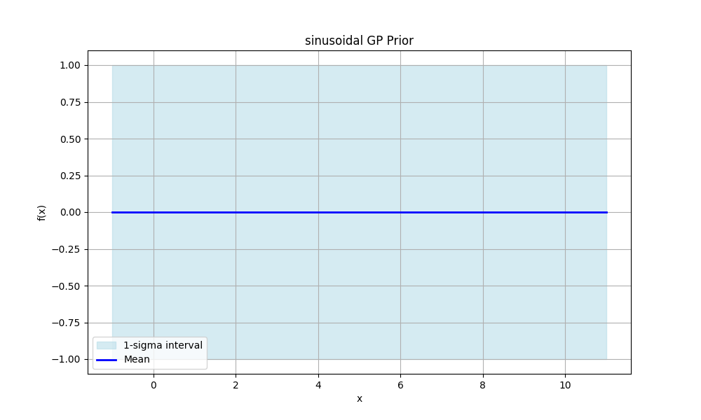

# GPredict: Gaussian Process Regression Tool

GPredict is a Python tool for performing **Gaussian Process (GP) regression** for **predictive modeling** and **uncertainty quantification**.  
It provides a full workflow for **statistical modeling**, **kernel-based regression**, and **probabilistic prediction** with reproducible outputs.

---

## Gaussian Process Model

GPredict models observations `(x_i, y_i)` with uncertainties `dy_i` using:

\[
f(x) \sim \mathcal{GP}(m(x), k(x, x'))
\]

- `m(x)` — mean function (linear, constant)  
- `k(x, x')` — kernel function (RBF, Matern)  
- Posterior predictions include **mean estimates** and **1σ confidence intervals**.  

This approach allows **non-parametric regression** and **probabilistic modeling**, capturing both trends and predictive uncertainty.

---

## Posterior Inference

Given training data, GPredict computes:

\[
\mu_* = K_*^T (K + \Sigma)^{-1} y, \quad
\Sigma_* = K_{**} - K_*^T (K + \Sigma)^{-1} K_*
\]

- `Σ = diag(dy_i^2)` accounts for observational noise.  
- **Posterior sampling** generates predictive trajectories, useful for regression analysis and visualization.  

---

## Example: Sinusoidal Function

**Function:**  
F(x) = sin(x)

**Observations:**  
20 points with heteroscedastic errors

**Predictions:**

| Prior | Posterior |
|-------|-----------|
|  |  |

- **Prior:** Shows the assumed mean and kernel-based uncertainty before seeing data.  
- **Posterior:** Updates predictions with observed data, providing predictive intervals.

---

## Features

- Customizable **mean functions** (linear, constant)  
- **Kernel methods**: RBF and Matern  
- Posterior **predictive sampling** for trajectory generation  
- Visualization of **prior and posterior** with confidence intervals  
- Handles **heteroscedastic noise**  
- Fully reproducible via fixed random seed  
- Automatic saving of:
  - Observational data (`.txt`)  
  - GP prior/posterior plots (`.png`)  
  - Predictive summaries (`.txt`)

---

## Usage

```bash
python3 main.py
```

Outputs:

- `data/` — observations  
- `plots/` — prior & posterior visualizations  
- `results/` — numerical predictions

---

## Project Structure

```
GPredict/
├── data/          # Observations
├── plots/         # GP prior and posterior plots
├── results/       # Predictive summaries
├── gp.py          # GP fitting, prediction, and sampling
├── kernels.py     # Kernel definitions
├── means.py       # Mean functions
├── utils.py       # Plotting and saving results
├── examples.py    # Example workflows
└── main.py        # Execute examples
```

---

## License

MIT License — see `LICENSE` for details.

